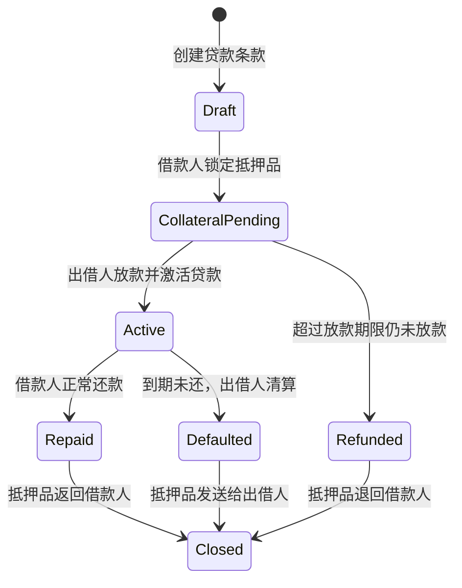

# Bitcoin 资产抵押借贷设计

> 状态：讨论稿。本文用于明确产品目标和协议流程，尚未代表已经实现或可用于主网。

逐阶段功能需求和验收标准见 [Bitcoin 资产抵押借贷 TRD 与验收计划](ASSET-LENDING-TRD.zh-CN.md)。

## 1. 目标

新建一个独立的点对点抵押借贷项目：借款人将 Runes 资产放入 Taproot 金库，出借人提供 BTC；正常还款后抵押品回到借款人，逾期未还时出借人可以取得抵押品。现有 Bitcoin Asset Time Lock 工具只作为协议研究参考，不复用它的项目结构或源码。

目标示例：

```text
借款人 Alice 抵押：100 ORDI
出借人 Bob 放款：10,000 sats（0.0001 tBTC）
利息：500 sats
期限：10 个区块
```

最终必须实现两种结果：

```text
正常还款：Alice 支付 10,500 sats → 100 ORDI 返回 Alice
到期违约：Alice 未还款           → 100 ORDI 由 Bob 领取
```

第一版优先在 Bitcoin Testnet4 上验证，先支持固定本金、固定利息和固定期限，不接入自动撮合及价格预言机。

## 2. 当前工具与借贷工具的区别

当前工具只有资产所有者一个角色：

```text
资产所有者锁定资产
        ↓
等待指定区块数
        ↓
资产所有者签名取回
```

当前 Taproot 金库的规则可以简化为：

```text
等待 N 个区块 + 原所有者签名 → 允许取回
```

新的借贷工具有借款人和出借人两个角色，金库需要根据贷款状态选择不同出口：

```text
                         抵押金库
                            │
             ┌──────────────┴──────────────┐
             │                             │
          正常还款                      到期违约
             │                             │
        抵押品回借款人                抵押品给出借人
```

因此，借贷版需要替换当前单一的时间锁脚本，并新增放款、还款、违约领取和双方签名流程。

## 3. 参与者

### 3.1 借款人 Borrower

- 提供抵押资产。
- 接收贷款本金。
- 在期限内归还本金和利息。
- 正常还款后取回抵押资产。

### 3.2 出借人 Lender

- 检查抵押资产、数量、网络和金库脚本。
- 向借款人提供 BTC。
- 正常还款时协助释放抵押品。
- 借款人违约后领取抵押品。

### 3.3 协调页面 Coordinator

- 构造和展示贷款条款。
- 构造 PSBT，但不持有双方私钥。
- 让双方分别检查和签名。
- 查询 Bitcoin 交易状态和资产索引状态。
- 保存恢复贷款所需的公开数据。

协调页面不应接触助记词或私钥。

### 3.4 Testnet4 测试账户

借贷流程需要两个不同地址分别扮演借款人和出借人。

快速功能测试可以在同一个 UniSat HD Wallet 中创建两个账户：

```text
Account 1：Alice（借款人，持有抵押资产和手续费）
Account 2：Bob（出借人，持有贷款本金和手续费）
```

建议的初始测试余额：

```text
Alice：100 ORDI + 至少 20,000 sats 手续费余额
Bob：至少 30,000 sats
     ├── 10,000 sats 贷款本金
     └── 剩余部分支付放款、还款确认和清算相关手续费
```

如果 Account 1 已经有足够的 Testnet4 tBTC，可以直接向 Account 2 转入测试币，不必再次领取水龙头。

同一个 HD Wallet 下的两个账户通常由同一套助记词派生，适合验证页面和交易流程，但不能证明真正的双方密钥隔离。安全测试应使用两个完全独立的钱包、助记词或浏览器环境，分别模拟 Alice 和 Bob。

## 4. 贷款条款

每笔贷款至少需要以下信息：

| 字段 | 含义 |
| --- | --- |
| Network | Bitcoin Testnet4、Bitcoin Mainnet 等网络 |
| Asset type | BRC-20 或 Runes |
| Asset ID | BRC-20 Tick 或 Rune ID |
| Collateral amount | 抵押资产数量 |
| Principal | 出借的 BTC 数量 |
| Interest | 到期应支付的利息 |
| Loan term | 从贷款激活开始计算的区块数 |
| Funding timeout | 出借人未放款时允许取消的期限 |
| Borrower public key | 借款人公钥 |
| Lender public key | 出借人公钥 |
| Borrower address | 借款人的 BTC 接收地址 |
| Lender address | 出借人的还款及清算接收地址 |

所有字段必须在签名前由双方确认，并写入可恢复的贷款记录。

## 5. 推荐的产品状态



建议使用以下状态名称：

| 状态 | 含义 |
| --- | --- |
| Draft | 条款尚未签署 |
| Collateral Pending | 抵押品已准备，等待放款 |
| Active | 已放款，贷款期限开始计算 |
| Repaid | 已完成还款，等待或已经返还抵押品 |
| Defaulted | 已到期且未还款，允许出借人领取抵押品 |
| Refunded | 未完成放款，抵押品退回借款人 |
| Closed | 贷款流程结束 |

## 6. Taproot 金库规则

第一版活动贷款金库建议包含两个脚本出口。

### 6.1 双方合作关闭

```text
借款人签名 + 出借人签名 → 可以花费抵押输出
```

借款人正常还款后，双方共同签署抵押品返还交易，将资产发回借款人。

### 6.2 到期违约清算

```text
等待 Loan Term 个区块 + 出借人签名 → 可以花费抵押输出
```

超过期限后，如果贷款仍未正常关闭，出借人可以单独领取抵押品。

脚本概念如下：

```text
Taproot Loan Vault
├── Cooperative leaf
│   └── Borrower signature + Lender signature
└── Default leaf
    └── Relative time lock + Lender signature
```

Taproot internal key 应继续使用没有已知私钥的 NUMS key，防止任何人通过普通 key-path 绕开脚本规则。

## 7. 完整业务流程

### 阶段 A：创建贷款提议

1. Alice 连接钱包并选择抵押资产。
2. Alice 填写抵押数量、期望本金、利息和期限。
3. 页面生成贷款提议 ID 和可分享的公开条款。
4. Bob 打开提议，连接钱包并检查条款。
5. 双方确认网络、公钥、地址和资产数量。

这一阶段不移动资产。

### 阶段 B：准备抵押品

1. 页面根据双方公钥和贷款期限计算 Taproot 金库。
2. Alice 将抵押资产放入等待激活的抵押输出。
3. 页面等待交易确认和资产索引器确认。
4. Bob 检查真实链上输出与页面条款是否一致。

在 Bob 放款前，必须确认：

- 抵押资产类型及数量正确；
- 抵押输出真实存在且已确认；
- Taproot 脚本包含正确的双方公钥和期限；
- 抵押输出不存在借款人可以立即单独取回的路径；
- 存在贷款未激活时安全退款的路径。

### 阶段 C：放款并激活

理想情况下，放款和抵押金库激活应属于同一个双方签署的交易流程：

```text
输入：等待激活的抵押输出 + Bob 的 BTC

输出：活动贷款金库中的抵押品 + 给 Alice 的贷款本金
```

双方检查完整 PSBT 后签名。一旦广播，Alice 收到本金，抵押品同时进入活动贷款金库；贷款期限从活动金库输出确认后开始计算。

对于 Runes，这种原子激活方式较容易实现。BRC-20 由于 Transfer 铭文只能使用一次，还需要额外的铭文状态转换，见第 9 节。

### 阶段 D1：正常还款

1. Alice 在期限内发起本金加利息的还款交易。
2. Bob 检查还款金额和接收地址。
3. 双方共同签署抵押品返还交易。
4. 抵押品发送回 Alice。
5. 页面将贷款标记为 Repaid / Closed。

第一版采用双方合作签名，因此存在 Bob 收到还款后拒绝释放抵押品的信任问题。正式版本应让“Bob 获得还款”和“Alice 取回抵押品”具备原子关系，见第 10 节。

### 阶段 D2：到期违约

1. 页面确认活动金库已经经过约定区块数。
2. Bob 构造违约领取交易。
3. Bob 使用自己的钱包签名。
4. Bitcoin 节点检查相对时间锁和 Bob 的签名。
5. 抵押品发送到 Bob 的地址。
6. 页面将贷款标记为 Defaulted / Closed。

### 阶段 D3：未放款退款

如果 Alice 已经准备抵押品，但 Bob 没有在 Funding Timeout 前完成放款，则 Alice 必须能够取回抵押品。

不能简单地在活动金库中增加一个“若干区块后 Alice 单独退款”的永久出口，否则 Bob 放款后 Alice 仍可能使用该出口取走抵押品。正确方式是区分等待激活金库和活动贷款金库：

```text
等待激活金库
├── 双方签名 → 转入活动贷款金库并同时放款
└── 超过 Funding Timeout + Alice 签名 → 退款

活动贷款金库
├── 双方签名 → 正常返还 Alice
└── 超过 Loan Term + Bob 签名 → 违约清算
```

放款成功时必须花消费等待激活输出，生成新的活动贷款输出，使旧退款路径自动失效。

## 8. Runes 实现路线

Runes 建议作为第一阶段实现目标，原因是 Runestone 可以在一笔交易中明确分配资产输出。

推荐流程：

1. Alice 将指定 Rune 数量分配到等待激活金库。
2. 放款激活交易同时使用等待激活输出和 Bob 的 BTC 输入。
3. 交易将 Rune 分配到活动贷款金库，并将本金发送给 Alice。
4. 正常还款时双方签署 Rune 返还交易。
5. 违约后 Bob 通过时间锁脚本领取 Rune。

必须保留 Rune change output 和 Runestone pointer，避免误把其他 Runes 一同抵押或销毁。

## 9. BRC-20 实现路线

BRC-20 的余额由索引器根据铭文历史计算，Transfer 铭文只能完成一次资产转移。因此每次资产从一个地址移动到另一个地址，都需要准备新的 Transfer 铭文。

当前项目的五笔交易实现了：

```text
制作第一张 Transfer 铭文（2 笔）
→ 发送到时间锁地址（1 笔）
→ 在时间锁地址准备返还用 Transfer 铭文（2 笔）
```

借贷版至少会经历以下地址状态：

```text
Alice 钱包
→ 等待激活金库
→ 活动贷款金库
→ Alice 或 Bob
```

每次金库状态转换都可能消耗已有 Transfer 铭文，并要求生成下一张 Transfer 铭文。因此 BRC-20 借贷不能简单地把当前五笔流程中的公钥替换为 Bob 的公钥，需要重新设计完整交易链，并在每个阶段等待 BRC-20 索引器确认。

BRC-20 版本需要额外验证：

- 每张 Transfer 铭文的创建者和初始持有地址；
- Available 与 Transferable 余额变化；
- 等待激活金库到活动金库的资产状态转换；
- 正常返还和违约清算各自所需的最终 Transfer 铭文；
- 多笔未确认父子交易的广播和恢复；
- UniSat 与其他 BRC-20 索引器结果的一致性。

因此建议先完成 Runes 借贷 MVP，再开发 BRC-20 借贷版本。

## 10. 正常还款的原子性

双方合作签名适合测试版，但无法彻底解决以下问题：

```text
Alice 先还款 → Bob 可能拒绝释放抵押品
Bob 先释放抵押品 → Alice 可能拒绝还款
```

正式版本的目标是：

```text
Bob 能取得还款 ⇔ Alice 能取回抵押品
```

可研究的方案包括：

- 哈希时间锁交易（HTLC）；
- 预签名交易链；
- adaptor signatures；
- 独立仲裁人参与的 2-of-3 模式。

最终方案必须经过单独的协议设计和安全审查，不能只依赖前端判断“还款交易已出现”。

## 11. 链上标记和恢复

当前 `BATL v1` 标记描述的是普通资产时间锁。借贷版需要新版本或新的协议标记，至少记录：

- 协议版本；
- 资产类型；
- 抵押资产 ID；
- 抵押数量；
- 借款人公钥；
- 出借人公钥；
- 贷款期限；
- 贷款状态对应的金库输出；
- 条款哈希。

不应在 OP_RETURN 中放入姓名、联系方式或其他隐私信息。公开标记的目标是：即使浏览器 LocalStorage 被清除，也能根据链上交易重建贷款记录和可用操作。

## 12. 第一版产品范围

推荐的 Testnet4 MVP 范围：

- 一名借款人和一名出借人；
- 固定本金、固定利息；
- 固定区块期限；
- Runes 抵押；
- 借贷提议创建和分享；
- 等待激活金库；
- 双方签署放款激活交易；
- 双方合作完成正常还款；
- 到期后出借人领取抵押品；
- 未放款时借款人退款；
- 本地记录和链上恢复标记；
- Bitcoin Testnet4 全流程测试。

第一版暂不包含：

- 主网上线；
- BRC-20 抵押；
- 自动撮合订单簿；
- 实时价格预言机；
- 根据价格自动清算；
- 部分还款；
- 展期和再融资；
- 多出借人共同出资；
- 手续费抽成。

## 13. 后续阶段

### 阶段 1：Runes 协作式 Testnet4 MVP

验证抵押、原子放款激活、合作还款、未放款退款和到期清算。

### 阶段 2：降低正常还款的信任要求

研究并实现原子还款与抵押品返还，完善 PSBT 交换及断点恢复。

### 阶段 3：BRC-20 借贷

基于当前五笔锁仓流程重新设计等待激活和活动贷款两套 Transfer 铭文交易链。

### 阶段 4：安全和兼容性验证

覆盖交易重组、低费率卡住、双花、错误网络、索引器差异、浏览器数据丢失和手续费 UTXO 携带其他资产等情况。

### 阶段 5：主网准备

完成协议审查、钱包兼容测试、恢复工具、监控和用户风险提示后，再评估主网发布。

## 14. 验收目标

第一阶段可以在 Testnet4 上重复完成以下闭环时，才算达成目标：

1. Alice 创建贷款条款。
2. Alice 抵押 Rune。
3. Bob 在同一激活流程中完成 BTC 放款。
4. 活动贷款金库正确计算到期区块。
5. 正常还款场景下，Bob 收到本金和利息，Alice 取回抵押品。
6. 违约场景下，期限到达前 Bob 无法领取，期限到达后 Bob 可以领取。
7. 未放款场景下，Alice 能在 Funding Timeout 后退款。
8. 任意一方不能绕过 Taproot 脚本提前取得不属于自己的资产。
9. 清除浏览器本地记录后，可以根据链上标记恢复贷款状态。
10. 所有资产数量、交易输入、输出和手续费都能在区块浏览器中核对。

## 15. 结论

现有项目已经具备钱包连接、资产查询、交易构造、Taproot 相对时间锁和解锁能力，可以作为抵押借贷工具的技术基础。

推荐先实现 Runes Testnet4 借贷 MVP，使用“等待激活金库 → 活动贷款金库”两阶段结构，确保未放款可以退款、放款后退款路径失效。完成抵押、放款、还款和违约清算闭环后，再处理 BRC-20 多铭文交易链和原子还款问题。
