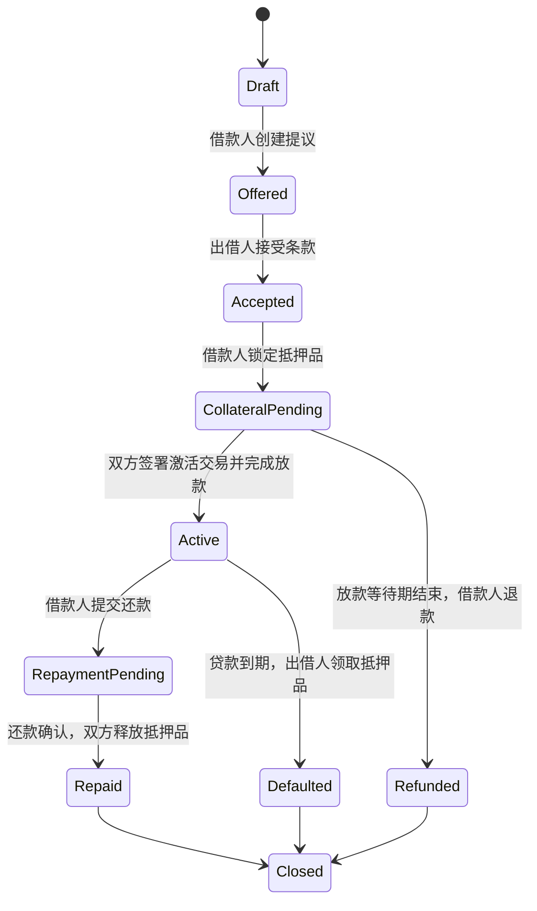

# Bitcoin 资产抵押借贷 TRD 与验收计划

> 文档状态：Draft v0.3  
> 当前阶段：阶段 1——独立页面与双方条款确认  
> 实现状态：已开始；链上交易功能尚未开放  
> 原则：借贷功能建立为全新独立项目。现有 Bitcoin Asset Time Lock 项目只作为协议研究参考，不作为新项目的代码基础。

## 1. 文档目的

本文把资产抵押借贷拆分为可以逐步开发、逐步演示、逐步验收的功能点。每个阶段只有在对应验收项全部通过后，才能进入下一阶段。

本文同时定义：

- 产品目标和第一版边界；
- 借款人、出借人和页面的职责；
- Taproot 金库与交易状态；
- 每个功能点的输入、输出和异常；
- 每个阶段需要提交的验收证据；
- Runes MVP 和 BRC-20 后续版本的边界。

## 2. 已确定的方向

| 编号 | 决定 |
| --- | --- |
| D-001 | 现有 Bitcoin Asset Time Lock 项目保持原样，不在其中开发借贷功能（已确认） |
| D-002 | 新建独立的 `bitcoin-asset-lending-tool` 项目，独立管理源码、依赖、构建、测试和 Git 历史（已确认） |
| D-003 | 第一阶段仅支持 Bitcoin Testnet4（已确认） |
| D-004 | 第一阶段先支持 Runes 抵押（已确认） |
| D-005 | BRC-20 借贷作为后续独立阶段，不直接套用当前五笔交易 |
| D-006 | 第一阶段采用一名借款人和一名出借人的固定期限贷款 |
| D-007 | 私钥始终由 UniSat 钱包持有，页面只构造待签名 PSBT |
| D-008 | 第一阶段正常还款采用双方合作签名，并明确显示其信任边界 |
| D-009 | 在原子还款方案完成安全审查前，不进入主网 |

如果后续改变以上决定，需要先更新本文，再开始相关代码修改。

## 3. 产品目标

借款人可以抵押 Bitcoin 链上的资产，向指定出借人借入 BTC：

```text
正常还款：本金和利息给出借人，抵押品返回借款人
到期违约：出借人通过时间锁路径取得抵押品
未完成放款：借款人在放款等待期结束后取回抵押品
```

Testnet4 首轮验收建议使用以下小额参数：

```text
抵押品：少量测试 Rune
贷款本金：10,000 sats
固定利息：500 sats
贷款期限：10 个区块
放款等待期：6 个区块
```

## 4. 第一版不解决的问题

第一版不包含：

- 主网资产；
- BRC-20 抵押；
- 自动撮合和订单簿；
- 法币报价；
- 价格预言机；
- 根据价格自动清算；
- 浮动利率；
- 部分还款；
- 展期和再融资；
- 多出借人共同出资；
- 平台托管私钥；
- 平台服务费和收入分配。

## 5. 测试身份和资金

快速功能测试使用两个 UniSat 账户：

```text
Account 1：Alice，借款人
Account 2：Bob，出借人
```

建议资金：

| 账户 | 资产 | 用途 |
| --- | --- | --- |
| Alice | 测试 Rune | 抵押品 |
| Alice | 至少 20,000 sats | 抵押、退款和还款相关手续费 |
| Bob | 至少 30,000 sats | 10,000 sats 本金及相关手续费 |

同一 HD Wallet 下的两个 Account 适合功能验收。独立密钥验收必须使用两套不同助记词或两个隔离的浏览器钱包环境。

## 6. 贷款状态机



状态只能通过已验证的链上交易改变，不能只根据浏览器按钮或 LocalStorage 改变。

## 7. 两阶段 Taproot 金库

### 7.1 等待激活金库 Pending Vault

用途：Alice 已经准备抵押品，但 Bob 尚未完成放款。

```text
出口 A：Alice + Bob 双方签名
        → 进入活动贷款金库，同时完成 BTC 放款

出口 B：等待 Funding Timeout + Alice 签名
        → 抵押品退回 Alice
```

### 7.2 活动贷款金库 Active Vault

用途：Bob 已经放款，贷款期限已经开始。

```text
出口 A：Alice + Bob 双方签名
        → 正常还款后，抵押品返回 Alice

出口 B：等待 Loan Term + Bob 签名
        → 违约后，抵押品发送给 Bob
```

### 7.3 必须满足的脚本约束

- 使用双方明确确认的压缩公钥；
- 使用相对区块锁 CSV；
- Taproot internal key 使用无已知私钥的 NUMS key；
- 不存在绕过脚本的普通 key-path；
- Pending Vault 与 Active Vault 必须是不同输出；
- 激活交易花费 Pending Vault，使其退款路径失效；
- 正常返还与违约领取花费同一个 Active Vault 输出，两种结果不能同时发生。

## 8. 功能需求

### F-001 独立项目边界

**需求**

- 新功能位于独立的 `bitcoin-asset-lending-tool` 项目；
- 新项目拥有自己的 `package.json`、源码目录、依赖锁文件、构建、测试和 Git 历史；
- 现有时间锁项目只作为只读参考，不直接引用它的源码、构建产物或运行状态；
- 需要参考的协议算法必须在新项目中重新实现，并用独立测试向量验证；
- 两个项目可以分别安装、启动、构建和测试。

**验收**

- 新项目可以在不安装、不启动原项目的情况下完成安装、构建和测试；
- 新项目中不存在指向原项目源码的路径依赖；
- 原项目中不存在借贷功能文件；
- 新项目可以独立启动并打开首页。

### F-010 钱包与角色

**需求**

- 支持连接 UniSat；
- 第一版只允许 Bitcoin Testnet4；
- 支持 Native SegWit 和 Taproot 钱包地址；
- 用户进入贷款时必须选择 Borrower 或 Lender 角色；
- 页面显示当前账户地址、公钥、网络和角色；
- 网络或账户变化时清空未签名交易数据。

**异常**

- 未安装钱包；
- 钱包拒绝连接；
- 网络不是 Bitcoin Testnet4；
- 地址类型不支持；
- 已存在钱包授权弹窗。

**验收**

- Alice 和 Bob 可以分别连接不同账户；
- 切换账户后角色信息同步更新；
- 切到 Mainnet 时禁止创建和签署测试贷款；
- 连续点击连接按钮不会产生多个钱包授权请求。

### F-020 创建和接受贷款提议

**需求**

Alice 填写：

- Rune ID；
- 抵押数量；
- BTC 本金；
- 固定利息；
- Loan Term；
- Funding Timeout；
- Bob 的公钥和收款地址。

页面生成：

- 唯一 Loan ID；
- 规范化条款 JSON；
- 条款哈希；
- 可复制或导出的贷款提议；
- 人类可读的确认摘要。

Bob 导入提议后必须重新确认所有字段，不能只信任 Alice 页面生成的摘要。

**验收**

- 相同条款得到相同条款哈希；
- 任意字段变化都会改变条款哈希；
- 非法 Rune ID、零金额、负利息或非法区块数被拒绝；
- Alice 和 Bob 页面计算出的 Loan ID、地址和条款哈希一致；
- 用户可以复制完整贷款提议并在另一浏览器导入。

### F-030 资产和 UTXO 检查

**需求**

- 查询 Alice 的指定 Rune 可转移余额；
- 选择足够的 Rune UTXO；
- 检查每个输入是否携带其他 Runes；
- 需要时生成 Rune change output 和 pointer；
- 普通手续费 UTXO 必须经过资产检查；
- 页面显示每个输入、资产组成和输出分配。

**验收**

- 单个 UTXO 足够时优先选择合适的单个输入；
- 单个 UTXO 不足时可以组合多个输入；
- 多余 Rune 返回 Alice；
- 输入中存在其他 Rune 时不会被误抵押或销毁；
- 余额不足、索引器异常和 UTXO 已花费时禁止签名。

### F-040 创建 Pending Vault

**需求**

- 根据 Alice 公钥、Bob 公钥和 Funding Timeout 构造 Pending Vault；
- 将指定 Rune 数量锁入 Pending Vault；
- 生成链上恢复标记；
- 记录抵押交易 ID、输出序号和确认高度；
- 抵押确认前不得进入激活流程。

**验收**

- 金库地址可以由相同条款稳定重建；
- 改变任意公钥或超时参数都会得到不同地址；
- 抵押输出包含准确的 Rune 数量；
- Funding Timeout 前 Alice 无法单独退款；
- Bob 无法单独花费 Pending Vault；
- 清除 LocalStorage 后仍可根据链上标记恢复记录。

### F-050 放款与原子激活

**需求**

激活交易同时包含：

- Pending Vault 抵押输入；
- Bob 提供的 BTC 输入；
- Active Vault 抵押输出；
- 支付给 Alice 的本金输出；
- Alice 和 Bob 各自的合法找零；
- 正确的 Runestone edict 和 pointer。

Alice 和 Bob 都必须检查完整交易后签名。交易缺少任意一方签名时不能广播。

**验收**

- Alice 收到准确本金时，抵押品同时进入 Active Vault；
- 不能只完成放款而不激活抵押金库；
- 不能只移动抵押品而不支付本金；
- 激活交易花费 Pending Vault，旧退款交易失效；
- Active Vault 的 Loan Term 从激活输出确认后开始计算；
- 双方找零和其他资产均保持正确。

### F-060 正常还款与合作释放

**需求**

- 页面计算本金加利息；
- Alice 构造还款交易；
- Bob 核对金额、接收地址和确认状态；
- Alice 与 Bob 签署 Active Vault 合作释放交易；
- 抵押 Rune 返回 Alice；
- 页面明确提示第一版正常还款依赖双方合作。

**验收**

- 少付 1 sat 也不能被标记为足额还款；
- 错误地址的付款不能被识别为还款；
- 未确认还款必须显示 Pending；
- 抵押品返还交易需要 Alice 和 Bob 两个签名；
- 返还后 Rune 数量准确；
- 已关闭贷款不能再次还款或清算。

### F-070 到期违约领取

**需求**

- 根据 Active Vault 确认高度计算到期高度；
- 到期前禁用违约领取；
- 到期后 Bob 可以构造并签署清算交易；
- Rune 抵押品发送到 Bob；
- 其他 Rune 和 BTC 找零按规则返回。

**验收**

- 到期前广播返回 `non-BIP68-final` 或在本地被阻止；
- 到期后仅 Bob 的有效签名即可通过默认路径；
- Alice 的单独签名不能使用默认路径；
- 清算后 Alice 不能再次取回同一抵押输出；
- 区块浏览器可以看到公开的 CSV 脚本和 Bob 公钥验证。

### F-080 未放款退款

**需求**

- Funding Timeout 从 Pending Vault 确认后计算；
- 超时前 Alice 不能单独退款；
- 超时后 Alice 可以签名退款；
- 激活成功后退款入口对应的旧输出已经被花费。

**验收**

- 未放款且未到期时退款失败；
- 未放款且到期后退款成功；
- 已激活贷款不能再执行 Pending Vault 退款；
- Bob 不能把未激活的抵押品单独转走。

### F-090 记录、分享和恢复

**需求**

- 保存贷款条款、角色、公钥、地址、交易 ID、Outpoint 和状态；
- 页面区分本地缓存状态与链上确认状态；
- 所有交易均提供可复制的区块浏览器链接；
- 可以导出不含私钥的恢复文件；
- 可以通过贷款 ID、链上标记或恢复文件重建状态。

**验收**

- 清除浏览器数据后成功恢复贷款；
- 恢复后计算出的 Pending Vault 和 Active Vault 地址与原记录一致；
- 不同网络的交易不会被错误导入；
- 交易重组后状态可以从 Confirmed 回退到 Pending；
- 恢复文件不包含私钥、助记词、签名授权或 OpenAPI Key。

### F-100 错误处理和断点续作

**需求**

- 钱包拒签后保留可安全重试的状态；
- 广播超时时根据预期 TXID 查询交易是否已经进入内存池；
- 父交易未确认时显示依赖关系；
- 不重复广播已经确认的交易；
- 页面显示用户下一步应该做什么。

**验收**

- 签名取消不会把贷款标记为已完成；
- 广播返回超时但交易已存在时不会重复创建新交易；
- 页面可以从最后一个未完成步骤继续；
- 同一贷款不会同时出现 Repaid 和 Defaulted；
- 页面刷新不会丢失已经签署但尚未广播的安全状态。

### F-110 BRC-20 后续扩展

**需求**

- 单独设计 Alice → Pending Vault → Active Vault → Alice/Bob 的 Transfer 铭文生命周期；
- 每次地址转换都明确 Available 和 Transferable 余额变化；
- 不复用已经消费过的 Transfer 铭文；
- 所有父子交易都能断点恢复；
- 至少对两个独立 BRC-20 索引结果进行核对。

**进入开发的前置条件**

- Runes MVP 全部验收通过；
- BRC-20 状态转换方案形成独立技术说明；
- 测试网验证 Pending Vault 到 Active Vault 的转换；
- 明确正常返还和违约清算分别需要多少笔交易；
- 完成资产不会永久困在脚本地址中的恢复分析。

## 9. 非功能需求

### NFR-001 安全

- 页面不读取或保存助记词、私钥；
- 签名前展示所有输入、输出、资产和手续费；
- 对网络、地址、公钥和资产 ID 做严格校验；
- 禁止使用已知私钥的 Taproot internal key 绕过脚本；
- 金库脚本和交易构造必须有独立测试向量。

### NFR-002 可理解性

- 页面使用“等待放款金库”“活动贷款金库”“正常还款”“到期清算”等用户语言；
- 技术详情放在可展开区域；
- 每一步只显示当前需要完成的动作；
- 状态页面明确区分已广播、未确认、已确认和已到期。

### NFR-003 可恢复性

- LocalStorage 只作为缓存；
- 核心状态必须可以从链上交易和公开恢复数据重建；
- 每个可花费金库都记录准确 Outpoint，而不只记录地址。

### NFR-004 兼容性

- 首轮支持最新版 UniSat；
- 支持 Bitcoin Testnet4 的 `tb1q` 与 `tb1p` 钱包地址；
- 交易可以在 mempool.space Testnet4 中独立核对。

### NFR-005 项目隔离

- 新项目的安装、构建和运行不能写入现有项目目录；
- 新项目不能通过相对路径导入现有项目源码；
- 现有时间锁功能和 BATL v1 仅作为兼容性研究对象；
- 借贷协议使用新的标记或新版本，不能冒充 BATL v1 普通时间锁。

## 10. 分阶段开发与验收

### 阶段 0：冻结需求和测试数据

**交付物**

- 本 TRD；
- 贷款条款 JSON Schema；
- 状态机定义；
- Pending Vault 和 Active Vault 脚本说明；
- 固定 Alice/Bob 测试公钥和预期地址向量。

**通过条件**

- 所有开放问题得到明确决定；
- 每个脚本出口都有对应的成功和失败测试；
- 不存在未定义的资产归属状态。

### 阶段 1：独立项目、页面与钱包角色

**交付物**

- 全新的独立项目；
- UniSat 连接；
- Alice/Bob 角色；
- Testnet4 网络保护；
- 贷款提议创建、复制和导入。

**通过条件**

- F-001、F-010、F-020 全部通过；
- 不产生任何资产交易也能完成演示。

### 阶段 2：Pending Vault

**交付物**

- Rune UTXO 选择；
- Pending Vault 地址；
- 抵押交易；
- 未放款退款交易；
- 链上恢复标记。

**通过条件**

- F-030、F-040、F-080 全部通过；
- 分别演示“等待期前退款失败”和“等待期后退款成功”。

### 阶段 3：放款与 Active Vault

**交付物**

- 双方签署的激活 PSBT；
- BTC 本金输出；
- Active Vault 抵押输出；
- 贷款到期高度计算。

**通过条件**

- F-050 全部通过；
- 一笔激活交易同时完成放款和抵押状态转换；
- 旧 Pending Vault 退款交易失效。

### 阶段 4：正常还款

**交付物**

- 还款交易；
- 还款识别；
- 双方合作释放交易；
- Repaid / Closed 状态。

**通过条件**

- F-060 全部通过；
- 完整演示 Alice 还款、Bob 收款、Alice 收回抵押品。

### 阶段 5：违约清算

**交付物**

- 到期倒计时；
- Bob 默认路径交易；
- Defaulted / Closed 状态。

**通过条件**

- F-070 全部通过；
- 到期前不能清算；
- 到期后 Bob 可以独立领取；
- 正常还款和违约清算不能同时成功。

### 阶段 6：恢复和异常处理

**交付物**

- 公开记录导出与导入；
- 链上恢复；
- 断点续作；
- 交易重组处理；
- 所有浏览器链接。

**通过条件**

- F-090、F-100 全部通过；
- 清除 LocalStorage 后完成恢复；
- 模拟广播超时和重组后状态仍正确。

### 阶段 7：BRC-20 研究原型

**交付物**

- 独立 BRC-20 交易生命周期文档；
- Testnet4 原型；
- 正常返还和违约清算测试记录。

**通过条件**

- F-110 的所有前置条件满足；
- 不影响已经验收的 Runes 功能；
- 再决定是否进入正式 BRC-20 开发。

## 11. 端到端验收场景

### E2E-001 正常还款

```text
Given  Alice 和 Bob 已接受相同贷款条款
And    Alice 已将 Rune 放入 Pending Vault
When   双方签署激活交易
Then   Alice 收到 10,000 sats
And    抵押 Rune 进入 Active Vault
When   Alice 支付 10,500 sats
And    双方签署返还交易
Then   Bob 收到正确还款
And    Alice 收回全部抵押 Rune
And    贷款状态为 Closed
```

### E2E-002 到期违约

```text
Given  贷款已经激活
And    Alice 未还款
When   Active Vault 尚未达到 Loan Term
Then   Bob 的清算交易不能广播成功
When   Active Vault 达到 Loan Term
Then   Bob 可以单独签名领取抵押 Rune
And    Alice 不能再花费同一抵押输出
And    贷款状态为 Closed
```

### E2E-003 未放款退款

```text
Given  Alice 已把抵押 Rune 放入 Pending Vault
And    Bob 没有签署激活交易
When   Funding Timeout 尚未到达
Then   Alice 不能单独退款
When   Funding Timeout 已到达
Then   Alice 可以单独取回全部抵押 Rune
And    Bob 不能取得抵押品
And    贷款状态为 Closed
```

### E2E-004 数据丢失恢复

```text
Given  一笔贷款已经激活
And    浏览器 LocalStorage 被清除
When   用户导入 Loan ID、恢复文件或扫描链上标记
Then   页面重建相同贷款条款
And    重建相同 Pending/Active Vault 地址
And    找到准确的当前 Outpoint
And    显示正确链上状态和可执行操作
```

### E2E-005 双账户隔离

```text
Given  Alice 和 Bob 使用两个独立钱包
When   Alice 尝试使用 Bob 的默认路径
Then   签名验证失败
When   Bob 尝试在到期前使用默认路径
Then   时间锁验证失败
When   Bob 在到期后使用默认路径
Then   交易验证成功
```

## 12. 每阶段验收证据

每个阶段完成时必须提供：

- 功能点验收清单；
- 使用的 Testnet4 地址和公开交易 ID；
- 每笔交易输入、输出、手续费和资产分配表；
- 正常路径录屏或连续截图；
- 至少一个失败路径的截图或测试输出；
- 构建结果；
- 自动化测试结果；
- 已知限制；
- 新旧项目不存在源码、依赖和运行时耦合的检查结果。

任何验收项不能只以“页面提示成功”为证据，涉及链上状态的结果必须能通过区块浏览器或独立节点接口核对。

## 13. 开发开始前需要确认的参数与问题

| 编号 | 问题 | 当前方案 | 状态 |
| --- | --- | --- | --- |
| Q-001 | 第一版抵押资产 | Runes | 已确认 |
| Q-002 | 第一版网络 | Bitcoin Testnet4 | 已确认 |
| Q-003 | 正常还款方式 | 双方合作签名，并明确提示信任边界 | 待确认 |
| Q-004 | 放款激活方式 | Pending Vault 与 BTC 本金在同一双方签署交易中完成 | 待确认 |
| Q-005 | 测试账户 | 先用 UniSat Account 1/2，安全验收再用独立钱包 | 待确认 |
| Q-006 | 测试本金 | 10,000 sats | 待确认 |
| Q-007 | 测试利息 | 500 sats | 待确认 |
| Q-008 | Loan Term | 10 blocks | 待确认 |
| Q-009 | Funding Timeout | 6 blocks | 待确认 |
| Q-010 | 借贷协议标记 | 新协议名和编码待定，不复用 BATL v1 | 待确认 |

## 14. Definition of Done

借贷 MVP 只有同时满足以下条件才算完成：

- 阶段 0 至阶段 6 的验收全部通过；
- 正常还款、到期违约、未放款退款三个闭环均有独立 Testnet4 交易证据；
- 两个独立钱包的权限隔离测试通过；
- 清除本地数据后可以恢复贷款；
- 新项目无需安装或启动原项目即可独立完成全部验收；
- 所有签名前都能看到完整输入、输出、资产和手续费；
- 已明确记录第一版合作还款的信任边界；
- 项目仍标记为 Testnet MVP，不提供 Mainnet 入口。

完成以上验收后，才进入原子还款方案和 BRC-20 借贷的下一轮 TRD。
